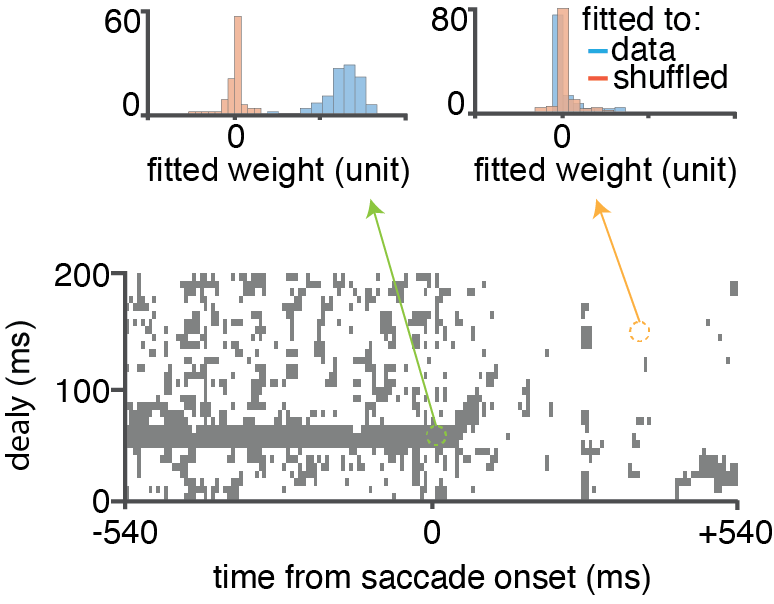
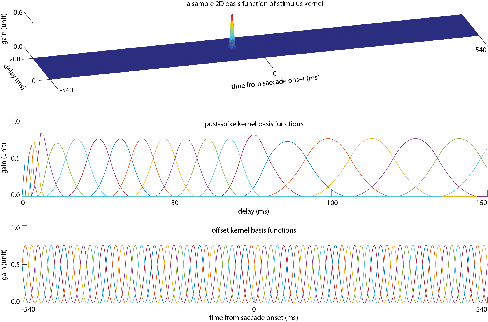

# Data flow
> All the following figures plotted for the neuron id `1505111501` and its receptive field proble location (probe index `52`). For more details see [1].

## Paradigm, Stimuli, Responses

### Grid

### Stimulus

### Behavior

### Eye trace

## Bases and Profile

## Kernels

## Predictions

## References
[1] Niknam, K., Akbarian, A., Clark, K., Zamani, Y., Noudoost, B., & Nategh, N. (2019). Characterizing and dissociating multiple time-varying modulatory computations influencing neuronal activity. PLoS computational biology, 15(9), e1007275. [View Article](https://journals.plos.org/ploscompbiol/article?id=10.1371/journal.pcbi.1007275)
